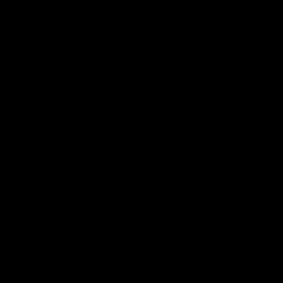
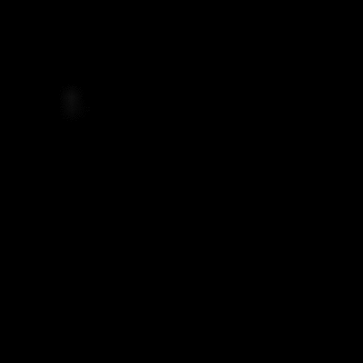
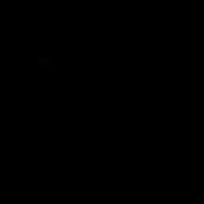

# vae_dyn
Synthesizing sequence of images by learning latent dynamics and VAE. Adapted from [VRNN](https://github.com/phreeza/tensorflow-vrnn).
## Dependencies:

Tensorflow (1.2)

## Image Sequence Samples

